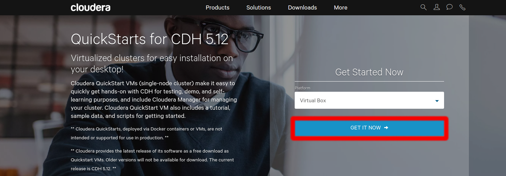
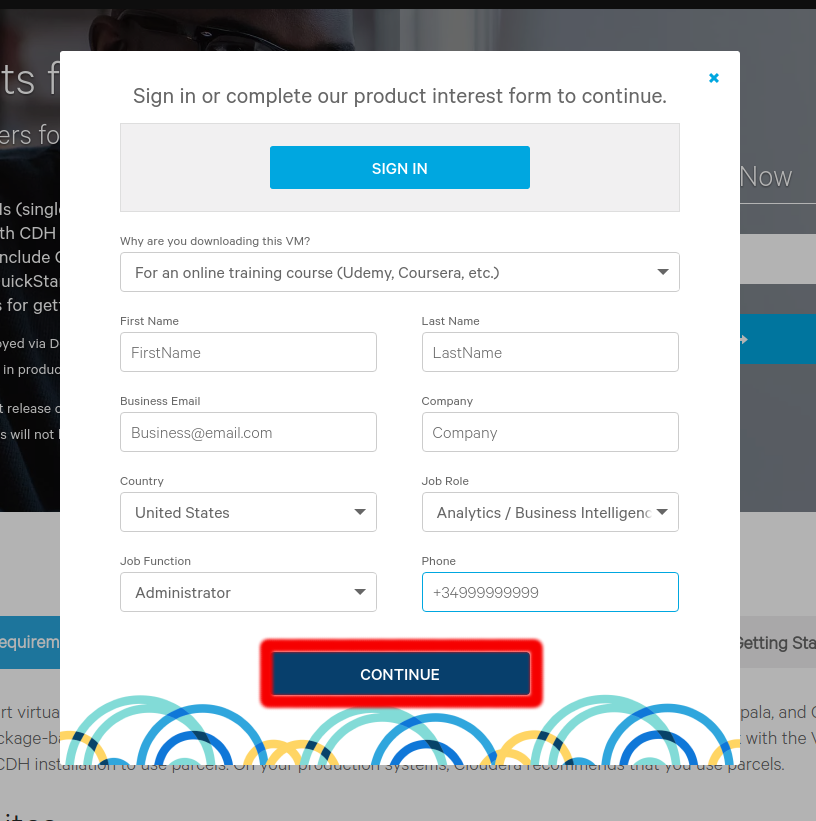
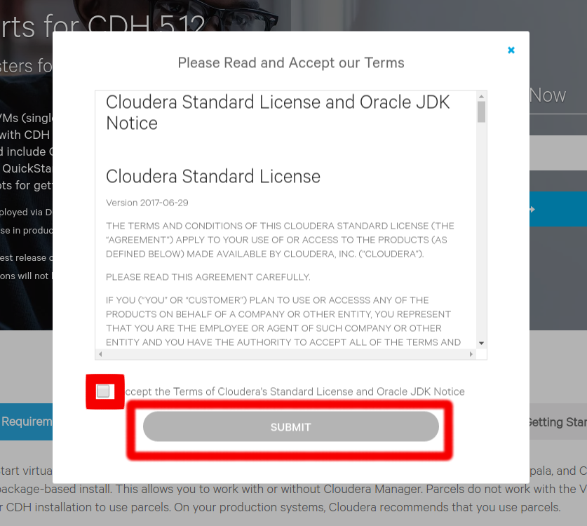
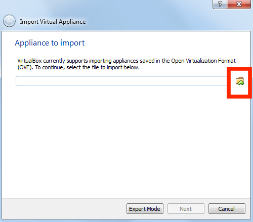
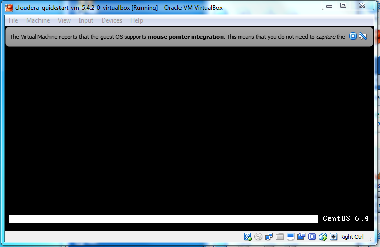
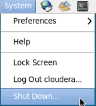

Instrucciones de instalación de la Cloudera Quickstart VM
=========================================================

Siga las siguientes instrucciones para la descarga e instalación de la Máquina Virtual (MV) Cloudera Quickstart para VirtualBox.
Las capturas de pantalla son de un ordenador Mac, pero las instrucciones deberían ser también válidas para Windows. En caso de encontrar algún problema revise los foros de soporte. 

1. Instale VirtualBox. Vaya a https://www.virtualbox.org/wiki/Downloads  para descargar e instalar VirtualBox en su ordenador.

2. Vaya a la página de descargas de Cloudera (https://www.cloudera.com/downloads/quickstart_vms.html)  y descargue el fichero que contiene la máquina virtual, siguiendo los pasos a continuación: 
    
    * Seleccione la plataforma *VirtualBox*
    
         
    
    * Haga clic en el botón *GET IT NOW*
    
        
    
    * Rellene el formulario y haga clic en *Continue*
    
        
        
    * Acepte los Términos y Condiciones y haga clic en *SUBMIT* para iniciar la descarga. 
    
        
        
    El tamaño de la MV es superior a 4GiB, así que este proceso puede tardar un poco.

3. Extraiga la MV de Cloudera:

    Haga clic con el botón derecho del ratón en *cloudera-quickstart-vm-X.X.X-0-virtualbox.zip* y seleccione "Extraer Todo ..."

4. Arranque la aplicación VirtualBox.

5. Import la MV en la aplicación yendo a *Archivo -> Importar servicio virtualizado*

    

6. Clique en el icono de la Carpeta

    

7. Seleccione el fichero *cloudera-quickstart-vm-X.X.X-0-virtualbox.ovf* de la carpeta donde descomprimió la MV VirtualBox y clique en *Abrir*

    

8. Clique *Siguiente* para continuar.

    

9. Clique Importar.

    

10. La MV se importará en la aplicación. Esta operación puede tardar varios minutos.

    

11. Cuando la importación haya finalizado, la MV *cloudera-quickstart-vm...* aparecerá en la parte izquierda de la ventana de VirtualBox. Seleccionela y clique en el botón de "Iniciar" para arrancarla.

    

12. Arranque de la MV. El proceso de arranque de la Máquina Virtual puede tardar varios minutos, debido a que deben iniciarse multitud de herramientas de Hadoop.

    

13. Escritorio de la MV. Una vez completado el proceso de arranque, aparecerá el escritorio con un navegador abierto.

    

14. Apagar la MV de Cloudera. Para poder cambiar la configuración de la MV de Cloudera, es necesario apagarla. Si la MV está corriendo, clique en botón *System* de la barra de herramientas superior, y luego en *Shut Down...*.

	

15. A continuació clique en *Shut Down*:

    

